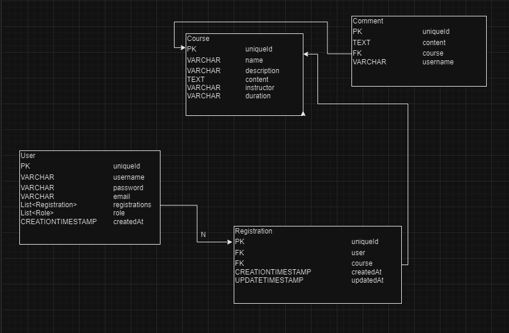

# Ymedu Education

Crash course platform

## Technologies

**Back-end:** Java 17, Spring Boot, Spring Data JPA, H2 Database

## Authors

- [@DevPedrosacul](https://www.github.com/DevPedrosacul)
- [@MTHias0](https://www.github.com/MTHias0)
- [@EdsKelvin](https://www.github.com/EdsKelvin)
- [@marquesdavi](https://www.github.com/marquesdavi)

## Database structure

